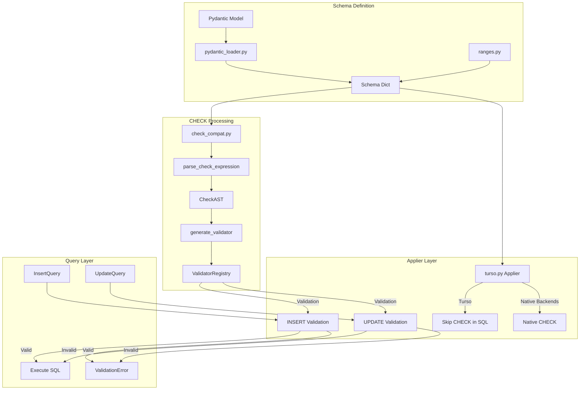
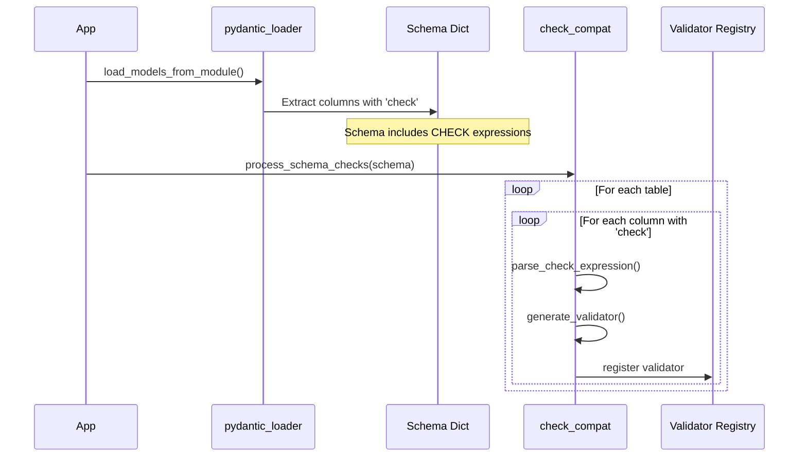
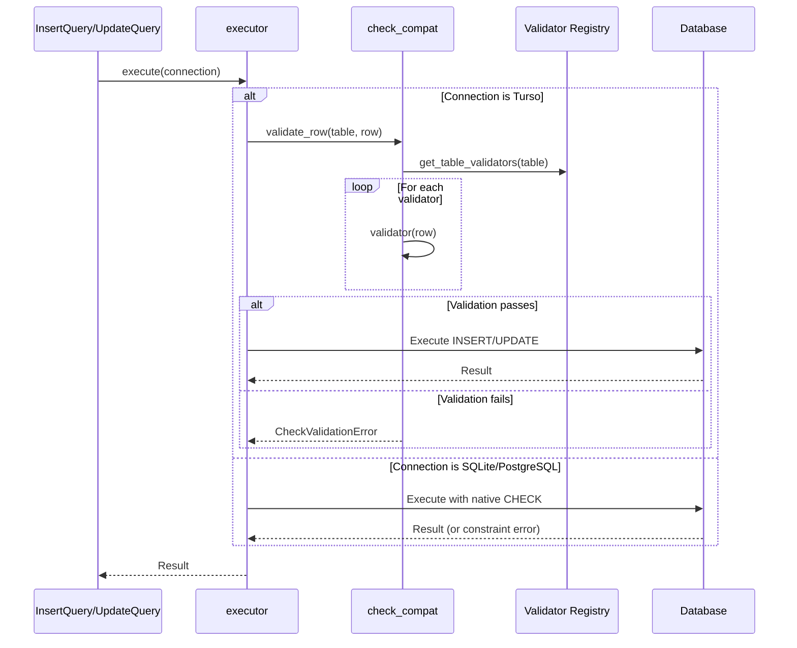

# CHECK Constraint Emulation Architecture

**Document Version**: 1.1
**Date**: 2026-02-01
**Updated**: 2026-03-06
**Status**: Superseded

---

**IMPLEMENTATION STATUS**: SUPERSEDED
**LAST VERIFIED**: 2026-03-06
**IMPLEMENTATION EVIDENCE**: Turso Database (Rust) now supports CHECK constraints natively (see COMPAT.md). Python-side emulation is no longer needed for any supported backend.

---

> **UPDATE (2026-03-06)**: Turso Database (Rust) now supports CHECK constraints natively.
> The Python-side emulation approach described in this document is **no longer required**.
> The Turso applier (`applier/turso.py`) now emits CHECK clauses directly in SQL,
> identical to the SQLite and PostgreSQL appliers. The `check_compat.py` module retains
> the registry/parser infrastructure but `process_schema_checks()` skips all known
> dialects (turso, postgresql, sqlite) since all support CHECK natively.
>
> This document is preserved for historical context.

## Executive Summary

~~This document defines the architecture for a CHECK constraint emulation layer in declaro-persistum. The Turso Database (Rust/pyturso) backend cannot parse CHECK constraints in CREATE TABLE SQL, breaking the facade pattern that allows seamless switching between PostgreSQL, SQLite, and Turso.~~

**Original problem (now resolved)**: Turso Database (Rust/pyturso) previously could not parse CHECK constraints in CREATE TABLE SQL. As of early 2026, Turso's COMPAT.md confirms full CHECK constraint support, making this emulation architecture unnecessary.

The solution ~~creates~~ created a pure functional abstraction layer (`abstractions/check_compat.py`) that:
1. Parses CHECK expressions into an AST representation
2. Generates Python validator functions from the AST
3. Stores validators in a registry keyed by (table, column)
4. Provides validation hooks for INSERT/UPDATE operations
5. ~~Modifies the Turso applier to skip SQL CHECK generation while maintaining constraint enforcement~~ **No longer needed** — Turso applier now emits CHECK in SQL natively

**Scope**: ~~CHECK constraint validation for Turso Database (Rust) backend only.~~ All backends (PostgreSQL, SQLite, Turso) now use native CHECK constraints. The emulation layer remains available as a fallback for any future backend that lacks CHECK support.

---

## Problem Statement

### Current State

The Turso applier at `applier/turso.py` generates CHECK constraints in `_column_definition()` (lines 180-181):
```python
if "check" in col:
    parts.append(f"CHECK ({col['check']})")
```

However, pyturso's SQL parser rejects CHECK constraint syntax, causing migration failures.

CHECK constraints in declaro-persistum originate from:
1. **Range abstraction** (`abstractions/ranges.py` line 56): `CHECK (start <= end)`
2. **Pydantic loader** (`pydantic_loader.py` lines 228-229): Explicit `check` metadata
3. **Explicit column definitions**: Direct `check` property in Column TypedDict
4. **Legacy enum fallback**: `generate_enum_check()` in sqlite.py (now superseded by FK lookup tables)

### User Need

Developers using declaro-persistum expect:
- Seamless backend switching without code changes
- Data integrity guarantees regardless of backend
- Consistent validation errors across all backends

### Constraints

- **No classes for business logic**: Must use pure functions following project standards
- **Immutable data structures**: All state via frozenset, tuple, or frozen dataclasses
- **Performance**: O(n) complexity for validation where n = number of constraints
- **Backward compatibility**: Existing code using CHECK constraints must work unchanged

---

## Technical Design

### Architecture Overview



### Component Details

#### 1. Check Expression Parser (`abstractions/check_compat.py`)

**Responsibility**: Parse SQL CHECK expressions into a typed AST

**Location**: `src/declaro_persistum/abstractions/check_compat.py`

**Dependencies**: `re`, `typing`

**Key Functions**:

```python
from typing import Any, TypedDict, Literal
from dataclasses import dataclass

# AST Node Types
class CheckAST(TypedDict, total=False):
    """Abstract syntax tree for CHECK expression."""
    op: Literal["compare", "between", "in", "and", "or", "not", "is_null", "is_not_null"]
    left: str | "CheckAST"
    right: Any | "CheckAST"
    operator: str  # For compare: =, !=, <, <=, >, >=
    values: list[Any]  # For IN clause


def parse_check_expression(
    expression: str,
    column_name: str,
) -> CheckAST:
    """
    Parse a SQL CHECK expression into an AST.

    Supported expressions:
    - Comparison: col <= value, col >= other_col
    - Range: col BETWEEN a AND b
    - Set membership: col IN ('a', 'b', 'c')
    - Null checks: col IS NULL, col IS NOT NULL
    - Boolean logic: expr AND expr, expr OR expr, NOT expr

    Args:
        expression: SQL CHECK expression string
        column_name: Column this constraint is attached to

    Returns:
        CheckAST representing the parsed expression

    Raises:
        CheckParseError: If expression cannot be parsed
    """
    ...
```

#### 2. Validator Generator

**Responsibility**: Generate Python validator functions from AST

**Key Functions**:

```python
from typing import Callable, Any
from collections.abc import Mapping

ValidatorFn = Callable[[Mapping[str, Any]], tuple[bool, str | None]]


def generate_validator(
    ast: CheckAST,
    table_name: str,
    column_name: str,
) -> ValidatorFn:
    """
    Generate a Python validator function from a CHECK AST.

    The validator takes a row dict and returns (is_valid, error_message).
    Error message is None if valid, descriptive string if invalid.

    Args:
        ast: Parsed CHECK expression AST
        table_name: Table name for error messages
        column_name: Column name for error messages

    Returns:
        Validator function (row_dict) -> (bool, str | None)

    Example:
        >>> ast = parse_check_expression("start <= end", "end")
        >>> validator = generate_validator(ast, "events", "end")
        >>> validator({"start": 10, "end": 5})
        (False, "CHECK constraint failed: events.end requires start <= end")
    """
    ...


def compile_row_validator(
    validators: frozenset[tuple[str, ValidatorFn]],
) -> ValidatorFn:
    """
    Compile multiple column validators into a single row validator.

    Runs all validators and collects errors.

    Args:
        validators: Frozenset of (column_name, validator_fn) tuples

    Returns:
        Combined validator function
    """
    ...
```

#### 3. Validator Registry (Module-Level State)

**Responsibility**: Store validators by (table, column) for lookup during INSERT/UPDATE

**Design**: Following `pragma_compat.py` pattern with module-level dicts and monitoring counters

```python
import logging
from typing import Any
from collections.abc import Mapping

logger = logging.getLogger(__name__)

# Registry: (table, column) -> ValidatorFn
_validator_registry: dict[tuple[str, str], ValidatorFn] = {}

# Monitoring counters
_validation_counts: dict[str, int] = {
    "checks_registered": 0,
    "validations_run": 0,
    "validations_passed": 0,
    "validations_failed": 0,
}

_validation_failures: list[dict[str, Any]] = []  # Recent failures for debugging


def register_check_constraint(
    table: str,
    column: str,
    expression: str,
) -> None:
    """
    Register a CHECK constraint for Python-side validation.

    Parses the expression and stores the generated validator.

    Args:
        table: Table name
        column: Column name
        expression: SQL CHECK expression
    """
    ...


def get_table_validators(table: str) -> frozenset[tuple[str, ValidatorFn]]:
    """
    Get all validators for a table.

    Returns:
        Frozenset of (column_name, validator_fn) tuples
    """
    ...


def validate_row(
    table: str,
    row: Mapping[str, Any],
    *,
    operation: str = "INSERT",
) -> tuple[bool, list[str]]:
    """
    Validate a row against all registered CHECK constraints for a table.

    Args:
        table: Table name
        row: Row data as dict
        operation: Operation type for error messages ("INSERT" or "UPDATE")

    Returns:
        Tuple of (is_valid, list_of_error_messages)
    """
    ...


def clear_registry() -> None:
    """Clear all registered validators (for testing)."""
    ...


def get_validation_stats() -> dict[str, Any]:
    """Get validation statistics for monitoring."""
    ...
```

#### 4. Turso Applier Modifications

**Responsibility**: Skip CHECK constraint SQL generation, register validators instead

**Location**: `src/declaro_persistum/applier/turso.py`

**Changes**:

```python
# In TursoApplier._column_definition():

def _column_definition(self, name: str, col: Column) -> str:
    """Generate column definition for CREATE TABLE."""
    sql_type = self._map_type(col.get("type", "text"))
    parts = [f'"{name}"', sql_type]

    # ... existing code ...

    # CHECK constraint handling for Turso
    if "check" in col:
        # Skip SQL generation - register for Python validation instead
        from declaro_persistum.abstractions.check_compat import (
            register_check_constraint,
            log_check_emulation,
        )
        # Note: table name must be passed through context
        # This is handled in _create_table_sql which has table context
        log_check_emulation(name, col["check"])
        # Actual registration happens in _create_table_sql

    # ... rest of existing code ...
    return " ".join(parts)


# New method to handle CHECK registration:
def _register_table_checks(
    self,
    table: str,
    columns: dict[str, Column],
) -> None:
    """Register CHECK constraints for Python-side validation."""
    from declaro_persistum.abstractions.check_compat import register_check_constraint

    for col_name, col_def in columns.items():
        if "check" in col_def:
            register_check_constraint(table, col_name, col_def["check"])
```

### Data Models

```python
from typing import TypedDict, Literal, Any
from collections.abc import Callable, Mapping


class CheckAST(TypedDict, total=False):
    """
    Abstract syntax tree node for CHECK expression.

    Attributes:
        op: Operation type
        left: Left operand (column name or nested AST)
        right: Right operand (value or nested AST)
        operator: Comparison operator for 'compare' op
        values: List of values for 'in' op
        operand: Single operand for 'not', 'is_null', 'is_not_null'
    """
    op: Literal["compare", "between", "in", "and", "or", "not", "is_null", "is_not_null"]
    left: str | dict[str, Any]  # Column name or nested AST
    right: Any | dict[str, Any]
    operator: str
    values: list[Any]
    operand: str | dict[str, Any]


class CheckParseError(Exception):
    """Raised when a CHECK expression cannot be parsed."""

    def __init__(self, expression: str, reason: str):
        self.expression = expression
        self.reason = reason
        super().__init__(f"Cannot parse CHECK: {expression!r} - {reason}")


class CheckValidationError(Exception):
    """Raised when CHECK constraint validation fails."""

    def __init__(
        self,
        table: str,
        column: str,
        expression: str,
        row: Mapping[str, Any],
    ):
        self.table = table
        self.column = column
        self.expression = expression
        self.row = dict(row)
        super().__init__(
            f"CHECK constraint failed: {table}.{column} "
            f"violates constraint {expression!r}"
        )


# Validator function signature
ValidatorFn = Callable[[Mapping[str, Any]], tuple[bool, str | None]]


class ValidationResult(TypedDict):
    """Result of row validation."""
    valid: bool
    errors: list[str]
    table: str
    operation: str
```

---

## Data Flow

### Schema Loading Flow



### INSERT/UPDATE Validation Flow



### State Transformations

| Stage | Input | Output | Side Effects |
|-------|-------|--------|--------------|
| Parse | CHECK expression string | CheckAST | None |
| Generate | CheckAST | ValidatorFn | None |
| Register | (table, column, expression) | None | Updates registry dict |
| Validate | (table, row) | (bool, errors) | Updates counters |

---

## Integration Points

### 1. Applier Integration

The Turso applier must be modified to:
1. Skip `CHECK (...)` in column definition SQL
2. Register CHECK constraints during table creation
3. Call `_register_table_checks()` in `_create_table_sql()`

### 2. Query Layer Integration (Optional Enhancement)

For complete enforcement, the query layer (`InsertQuery`, `UpdateQuery`) can integrate validation:

```python
# In InsertQuery.execute():
async def execute(self, connection: Any) -> list[dict[str, Any]]:
    from declaro_persistum.query.executor import execute

    dialect = _detect_dialect(connection)

    # For Turso, validate before execution
    if dialect == "turso":
        from declaro_persistum.abstractions.check_compat import (
            validate_row,
            CheckValidationError,
        )
        is_valid, errors = validate_row(self._table, self._values)
        if not is_valid:
            raise CheckValidationError(
                table=self._table,
                errors=errors,
                operation="INSERT",
            )

    return await execute(self.to_query(dialect), connection)
```

### 3. Schema Processing Hook

Add a function to process CHECK constraints from schema during initialization:

```python
def process_schema_checks(
    schema: dict[str, Any],
    dialect: str,
) -> None:
    """
    Process all CHECK constraints in a schema.

    For Turso dialect, registers Python validators.
    For other dialects, no-op (native CHECK used).

    Args:
        schema: Schema dict with table definitions
        dialect: Target database dialect
    """
    if dialect != "turso":
        return

    for table_name, table_def in schema.items():
        columns = table_def.get("columns", {})
        for col_name, col_def in columns.items():
            if "check" in col_def:
                register_check_constraint(
                    table_name,
                    col_name,
                    col_def["check"],
                )
```

---

## Error Handling

| Error | Cause | Handling |
|-------|-------|----------|
| `CheckParseError` | Unsupported CHECK syntax | Log warning, skip validation for column |
| `CheckValidationError` | Row violates constraint | Raise to caller with details |
| Missing column in row | Referenced column not in data | Skip validation (NULL handling) |
| Type mismatch | Cannot compare values | Log warning, skip check |

### Error Recovery

- **Parse failures**: Log and skip - allows graceful degradation for complex expressions
- **Validation failures**: Raise exception - must prevent invalid data
- **Missing data**: Treat as NULL - SQL semantics

---

## Testing Strategy

### Unit Tests

**Location**: `tests/unit/test_check_compat.py`

**Coverage target**: 95%+

| Function | Test Case | Expected |
|----------|-----------|----------|
| `parse_check_expression` | Simple comparison `a <= b` | AST with op='compare' |
| `parse_check_expression` | IN clause `x IN ('a', 'b')` | AST with op='in', values=['a', 'b'] |
| `parse_check_expression` | Compound `a AND b` | AST with op='and' |
| `parse_check_expression` | Invalid syntax | `CheckParseError` |
| `generate_validator` | Comparison | Validates correctly |
| `generate_validator` | IN clause | Validates correctly |
| `validate_row` | Valid data | `(True, [])` |
| `validate_row` | Invalid data | `(False, [error])` |
| `validate_row` | No constraints | `(True, [])` |

### Integration Tests

**Location**: `tests/integration/test_check_compat_turso.py`

| Scenario | Test Case | Expected |
|----------|-----------|----------|
| Table creation | CHECK constraint skipped in SQL | No parse error |
| INSERT valid | Row passes validation | Inserted successfully |
| INSERT invalid | Row fails validation | `CheckValidationError` |
| UPDATE valid | Row passes validation | Updated successfully |
| UPDATE invalid | Row fails validation | `CheckValidationError` |

### BDD Tests

**Location**: `tests/bdd/features/check_constraints.feature`

```gherkin
Feature: CHECK constraint emulation for Turso

  Scenario: Range column CHECK is enforced in Turso
    Given a schema with range columns (start, end)
    And the database is Turso
    When I create the table
    Then no CHECK constraint appears in the SQL
    And inserting start=10, end=5 raises CheckValidationError
    And inserting start=5, end=10 succeeds
```

---

## Success Criteria

### Functional Requirements

- [ ] CHECK expressions parse correctly for common patterns
- [ ] Validators enforce constraints on INSERT
- [ ] Validators enforce constraints on UPDATE
- [ ] Turso tables create without CHECK syntax
- [ ] SQLite/PostgreSQL unchanged (native CHECK)
- [ ] Monitoring counters track usage

### Performance Requirements

- [ ] Parse time < 1ms per expression
- [ ] Validation time < 0.1ms per constraint
- [ ] Registry lookup O(1)
- [ ] Memory overhead < 1KB per constraint

### Quality Requirements

- [ ] All tests passing
- [ ] Type hints complete
- [ ] No linting errors
- [ ] Documentation updated

---

## Supported CHECK Expression Grammar

The parser supports a subset of SQL CHECK expressions:

```
expression ::= comparison | between | in_clause | null_check | boolean_expr
comparison ::= identifier operator (identifier | literal)
between    ::= identifier BETWEEN literal AND literal
in_clause  ::= identifier IN '(' literal_list ')'
null_check ::= identifier IS [NOT] NULL
boolean_expr ::= expression (AND | OR) expression | NOT expression

identifier ::= [a-zA-Z_][a-zA-Z0-9_]*
operator   ::= '=' | '!=' | '<>' | '<' | '<=' | '>' | '>='
literal    ::= number | string | NULL
string     ::= '\'' [^']* '\'' | '"' [^"]* '"'
number     ::= [0-9]+ ('.' [0-9]+)?
literal_list ::= literal (',' literal)*
```

### Supported Patterns

| Pattern | Example | Notes |
|---------|---------|-------|
| Column comparison | `start <= end` | Both columns in same row |
| Value comparison | `age >= 18` | Column vs constant |
| IN clause | `status IN ('a', 'b')` | Set membership |
| BETWEEN | `price BETWEEN 0 AND 1000` | Range check |
| NULL check | `deleted_at IS NULL` | Null handling |
| Compound AND | `a > 0 AND b > 0` | Both must pass |
| Compound OR | `a > 0 OR b > 0` | Either passes |
| NOT | `NOT (x = y)` | Negation |

### Unsupported (Fall back to no validation)

- Subqueries
- Function calls (except basic COALESCE)
- LIKE/REGEXP patterns
- CASE expressions
- Arithmetic expressions

---

## Open Questions

- [ ] Should validation be automatic in query layer, or require explicit call?
- [ ] How to handle CHECK expressions referencing multiple tables (foreign keys)?
- [ ] Should unsupported expressions raise or warn?
