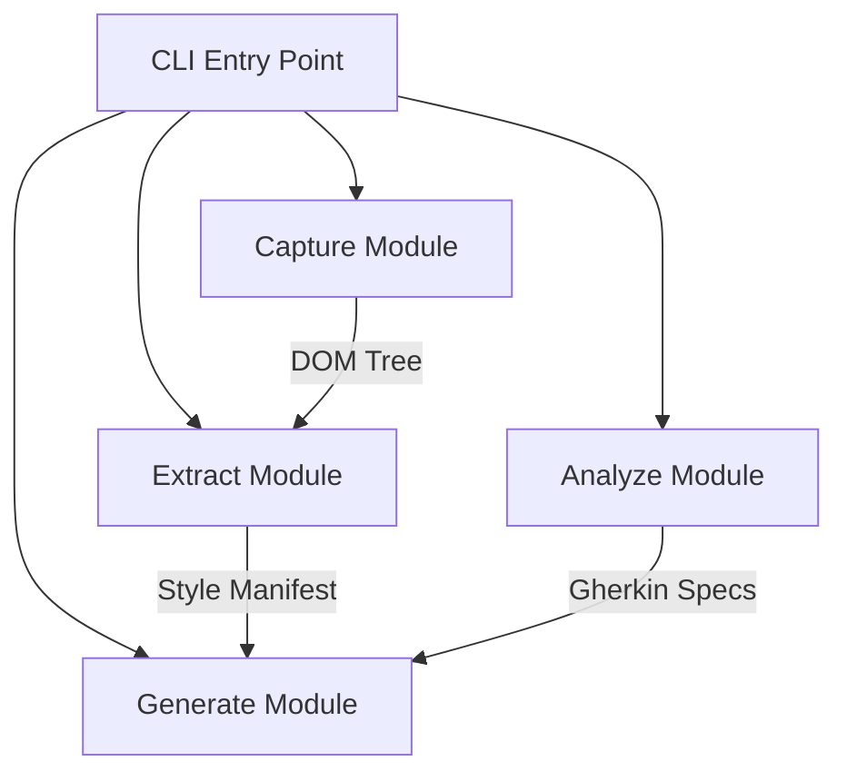
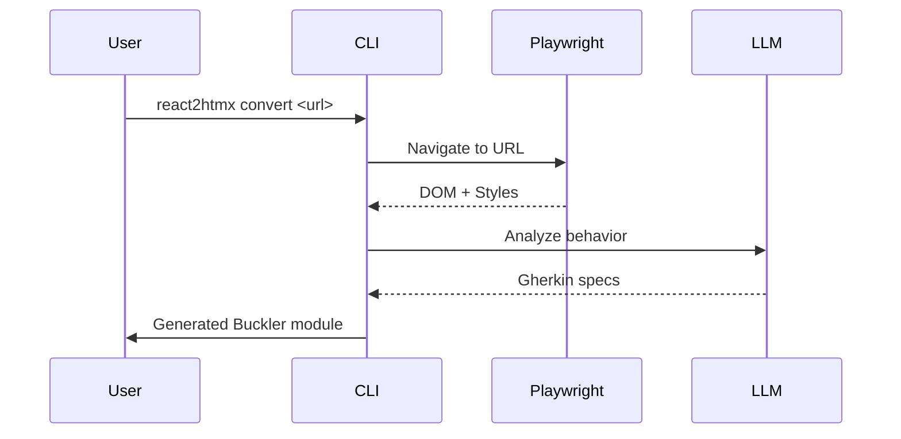
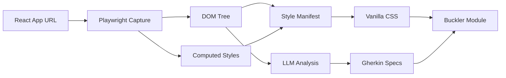

# Architecture Document Guidelines

**Document Version**: 1.0
**Date**: 2025-12-13
**Status**: MANDATORY FOR ARCHITECTURE DOCS
**Scope**: react2htmx Architecture Documentation

---

---
**IMPLEMENTATION STATUS**: PLANNED
**LAST VERIFIED**: 2025-12-13
**IMPLEMENTATION EVIDENCE**: Integrated with react2htmx documentation suite
---

## Purpose

This document defines the structure and requirements for architecture documents in the react2htmx project. Architecture docs serve as the design specification and implementation guide for features.

---

## Document Structure

### Required Sections

Every architecture document must include these sections:

1. **Executive Summary** (200-300 words)
2. **Problem Statement**
3. **Technical Design**
4. **Data Flow**
5. **CLI Interface** (if applicable)
6. **Error Handling**
7. **Testing Strategy**
8. **Success Criteria**
9. **Open Questions** (during design phase)

---

## Section Templates

### 1. Executive Summary

```markdown
## Executive Summary

[2-3 paragraphs covering:]
- What problem this solves
- The proposed solution approach
- Key architectural decisions
- Expected outcomes

**Scope**: [What is and isn't included]
```

### 2. Problem Statement

```markdown
## Problem Statement

### Current State
[What exists today, what's the gap]

### User Need
[Who needs this, why do they need it]

### Constraints
[Technical, business, or time constraints]
```

### 3. Technical Design

```markdown
## Technical Design

### Architecture Overview

[Mermaid diagram showing component relationships]

### Component Details

#### [Component Name]
- **Responsibility**: [What it does]
- **Location**: `path/to/module.py`
- **Dependencies**: [What it imports/uses]
- **Interface**: [Key functions/methods]

### Data Models

[Pydantic models with type annotations]

### Key Functions

[Function signatures with docstrings]
```

### 4. Data Flow

```markdown
## Data Flow

### Input → Output Flow

[Mermaid sequence diagram]

### State Transformations

| Stage | Input | Output | Side Effects |
|-------|-------|--------|--------------|
| ... | ... | ... | ... |
```

### 5. CLI Interface

```markdown
## CLI Interface

### Command Syntax

```bash
react2htmx [command] [arguments] [options]
```

### Commands

#### `react2htmx capture`

```bash
react2htmx capture <url> [options]

Arguments:
  url           URL of React application to capture

Options:
  -o, --output  Output file path (default: stdout)
  --viewports   Viewport sizes (default: 320,768,1024,1440)
  --timeout     Navigation timeout in ms (default: 30000)
```

### Examples

```bash
# Basic capture
react2htmx capture https://example.figma.site/ -o capture.json

# Custom viewports
react2htmx capture https://example.figma.site/ --viewports 375,768,1280
```
```

### 6. Error Handling

```markdown
## Error Handling

### Error Categories

| Category | Handling | User Message |
|----------|----------|--------------|
| Network failure | Retry 3x, then fail | "Could not connect to {url}" |
| Parse error | Log details, fail | "Failed to parse React component" |
| LLM error | Retry 1x, then fail | "Analysis service unavailable" |

### Error Recovery

[Describe rollback/retry strategies]
```

### 7. Testing Strategy

```markdown
## Testing Strategy

### Unit Tests

- **Location**: `tests/unit/[module]/`
- **Coverage target**: 90%+

#### Test Cases

| Function | Test Case | Expected |
|----------|-----------|----------|
| `extract_dom` | Empty page | Empty ElementCapture |
| `extract_dom` | Nested elements | Correct hierarchy |
| ... | ... | ... |

### Integration Tests

- **Location**: `tests/integration/`
- **Fixtures**: [What test data is needed]

### Manual Testing

[Steps to manually verify the feature]
```

### 8. Success Criteria

```markdown
## Success Criteria

### Functional Requirements

- [ ] [Specific testable requirement]
- [ ] [Specific testable requirement]

### Performance Requirements

- [ ] Capture completes in < 30s for typical apps
- [ ] Memory usage < 500MB during capture

### Quality Requirements

- [ ] All tests passing
- [ ] Type hints complete
- [ ] No linting errors
```

---

## Diagram Standards

### REQUIRED: Use Mermaid

All diagrams MUST use Mermaid syntax for version control compatibility.

**Rationale**:
- Text-based diagrams enable git diff
- No external tools required
- Renders in GitHub, VS Code, and modern markdown viewers
- Easy to update alongside code

### Diagram Types

#### Component/Architecture Diagrams



#### Sequence Diagrams



#### Data Flow Diagrams



### Diagram Requirements

- All diagrams embedded directly in markdown
- Each diagram has a descriptive caption
- Component names match actual code modules
- Data flow direction clearly indicated
- External dependencies visually distinguished

### FORBIDDEN

- PNG/JPG/SVG image files
- Screenshots of diagrams
- Diagrams created in external tools without Mermaid source

---

## Code Examples in Docs

### Function Signatures

Include complete type annotations:

```python
async def capture_viewport(
    page: Page,
    viewport_width: int,
    *,
    wait_for_idle: bool = True,
    timeout_ms: int = 30000,
) -> ViewportCapture:
    """Capture DOM state at a specific viewport width.

    Args:
        page: Playwright page instance
        viewport_width: Width in pixels for viewport
        wait_for_idle: Whether to wait for network idle
        timeout_ms: Maximum wait time in milliseconds

    Returns:
        ViewportCapture containing DOM tree and computed styles

    Raises:
        CaptureError: If capture fails or times out
        NetworkError: If page fails to load
    """
```

### Data Models

Include Pydantic model definitions:

```python
from pydantic import BaseModel, Field


class ElementCapture(BaseModel):
    """Captured DOM element with computed styles."""

    id: str = Field(..., description="Unique element identifier")
    tag: str = Field(..., description="HTML tag name")
    attributes: dict[str, str] = Field(default_factory=dict)
    computed_styles: dict[str, str] = Field(default_factory=dict)
    children: list["ElementCapture"] = Field(default_factory=list)
    text_content: str | None = None

    model_config = {"frozen": True}
```

---

## react2htmx-Specific Requirements

### Pipeline Stage Documentation

Each pipeline stage architecture doc must include:

1. **Input specification**: What data enters this stage
2. **Output specification**: What data exits this stage
3. **Transformation logic**: How input becomes output
4. **Error conditions**: What can go wrong
5. **Performance characteristics**: Time/memory expectations

### Example: Capture Stage Overview

```markdown
## Capture Stage

### Input
- URL of deployed React application
- Configuration (viewports, timeouts, interaction states)

### Output
- `CaptureResult` containing:
  - DOM tree as `ElementCapture` hierarchy
  - Computed styles per element per viewport
  - Interaction state styles (hover, focus, active, disabled)

### Transformation
1. Launch Playwright browser
2. Navigate to URL, wait for hydration
3. For each viewport size:
   - Resize viewport
   - Wait for layout stabilization
   - Extract DOM tree
   - Extract computed styles for all elements
4. For each interaction state:
   - Trigger state on interactive elements
   - Capture style differences

### Error Conditions
| Error | Cause | Recovery |
|-------|-------|----------|
| NavigationError | URL unreachable | Fail with clear message |
| TimeoutError | Page doesn't stabilize | Retry once, then fail |
| StyleExtractionError | CSS access denied | Log warning, continue |

### Performance
- Target: < 30s for 4 viewports
- Memory: < 500MB peak
```

---

## File Size Guidelines

### Target Size: 300-500 lines

Architecture docs should be comprehensive but focused.

| Length | Guidance |
|--------|----------|
| < 200 lines | Too brief - add more detail |
| 200-500 lines | Ideal range |
| 500-800 lines | Acceptable for complex features |
| > 800 lines | Split into multiple docs |

### Splitting Strategy

If a doc exceeds 800 lines, consider:

1. **By stage**: Separate docs for Capture, Extract, Analyze, Generate
2. **By concern**: Separate docs for core logic vs CLI interface
3. **By depth**: Overview doc + detailed implementation doc

---

## Review Checklist

Before finalizing an architecture document:

### Structure
- [ ] All required sections present
- [ ] Status header included and accurate
- [ ] Executive summary is 200-300 words

### Diagrams
- [ ] All diagrams use Mermaid syntax
- [ ] No binary image files referenced
- [ ] Diagrams have captions
- [ ] Component names match code

### Technical Content
- [ ] Function signatures include full type hints
- [ ] Data models show Pydantic definitions
- [ ] Error handling documented
- [ ] Performance expectations stated

### Testing
- [ ] Testing strategy specified
- [ ] Test file locations noted
- [ ] Success criteria are testable

### Quality
- [ ] Document is 300-800 lines
- [ ] No TODO placeholders remaining
- [ ] CLI examples are accurate
- [ ] Open questions section addressed (or empty)

---

## Template: New Feature Architecture Doc

```markdown
# [Feature Name] Architecture

**Date**: YYYY-MM-DD
**Version**: 1
**Author**: [Name]
**Status**: Draft | Review | Approved

---

---
**IMPLEMENTATION STATUS**: PLANNED
**LAST VERIFIED**: YYYY-MM-DD
**IMPLEMENTATION EVIDENCE**: Not yet implemented
---

## Executive Summary

[2-3 paragraphs describing what this feature does, why it's needed,
and the key architectural decisions. 200-300 words.]

## Problem Statement

### Current State

[What exists today, what gap does this fill]

### User Need

[Who needs this and why]

### Constraints

[Technical, time, or business constraints]

## Technical Design

### Architecture Overview

```mermaid
graph TB
    %% Add diagram
```

### Component Details

#### [Component 1]

- **Responsibility**: [What it does]
- **Location**: `react2htmx/[module]/[file].py`
- **Dependencies**: [What it uses]

### Data Models

```python
from pydantic import BaseModel, Field

class [ModelName](BaseModel):
    """[Description]."""

    field: Type = Field(..., description="[Description]")
```

### Key Functions

```python
def function_name(
    arg1: Type,
    arg2: Type,
) -> ReturnType:
    """[Description].

    Args:
        arg1: [Description]
        arg2: [Description]

    Returns:
        [Description]

    Raises:
        [Exception]: [When]
    """
```

## Data Flow

```mermaid
sequenceDiagram
    %% Add sequence diagram
```

### State Transformations

| Stage | Input | Output |
|-------|-------|--------|
| ... | ... | ... |

## CLI Interface

```bash
react2htmx [command] [options]

Options:
  -o, --output    [Description]
```

### Examples

```bash
# Example usage
react2htmx [command] [args]
```

## Error Handling

| Error | Cause | Handling |
|-------|-------|----------|
| ... | ... | ... |

## Testing Strategy

### Unit Tests

- **Location**: `tests/unit/[module]/`
- **Coverage**: 90%+

| Function | Test Case | Expected |
|----------|-----------|----------|
| ... | ... | ... |

### Integration Tests

- **Location**: `tests/integration/`

## Success Criteria

- [ ] [Functional requirement 1]
- [ ] [Functional requirement 2]
- [ ] [Performance requirement]
- [ ] [Quality requirement]

## Open Questions

- [ ] [Question 1]
- [ ] [Question 2]
```

---

## Conclusion

Architecture documents are the blueprint for implementation. By following these guidelines, we ensure:

1. **Consistent structure** across all feature docs
2. **Version-controlled diagrams** using Mermaid
3. **Complete specifications** for implementers
4. **Testable success criteria** for validation

When in doubt, refer to the main architecture document at `docs/architecture/react2htmx-architecture.md` as the canonical example.
