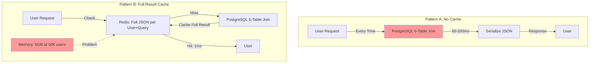
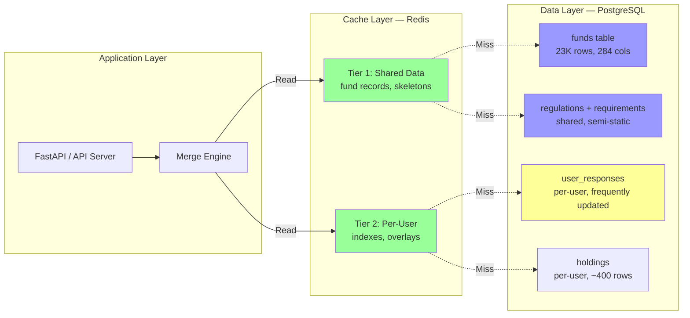
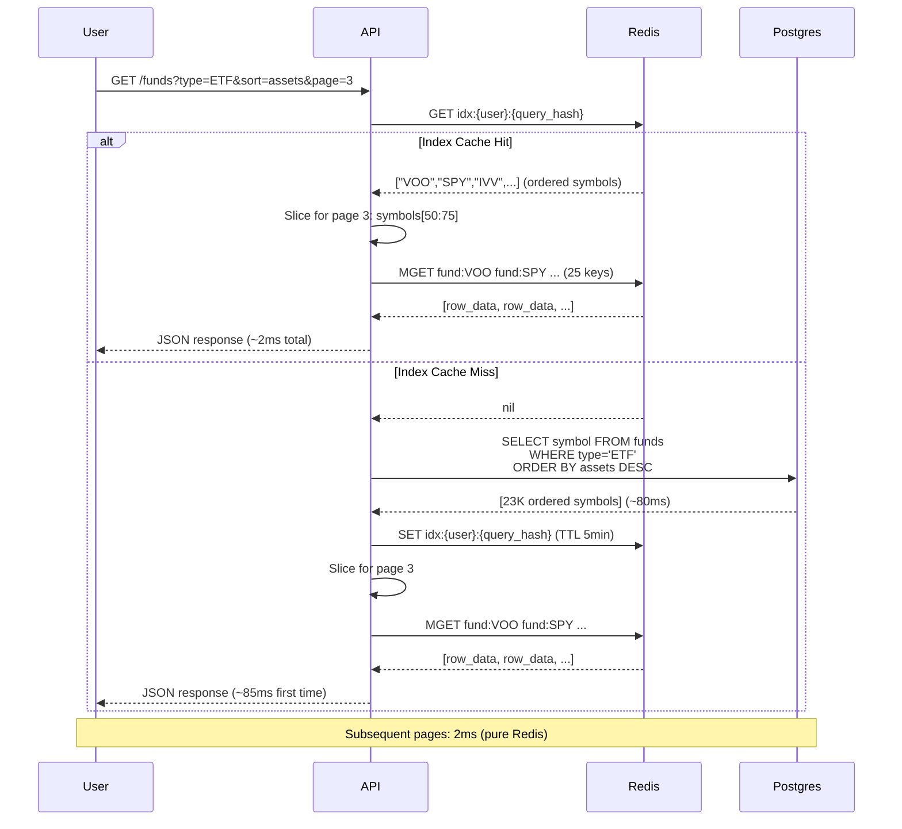
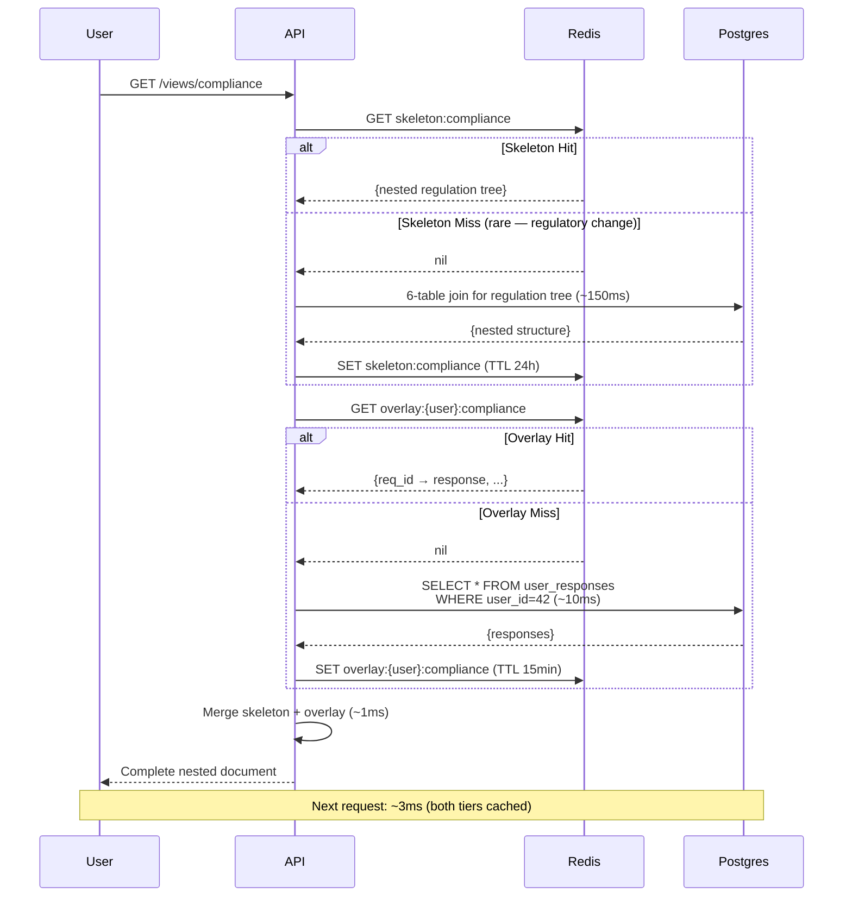
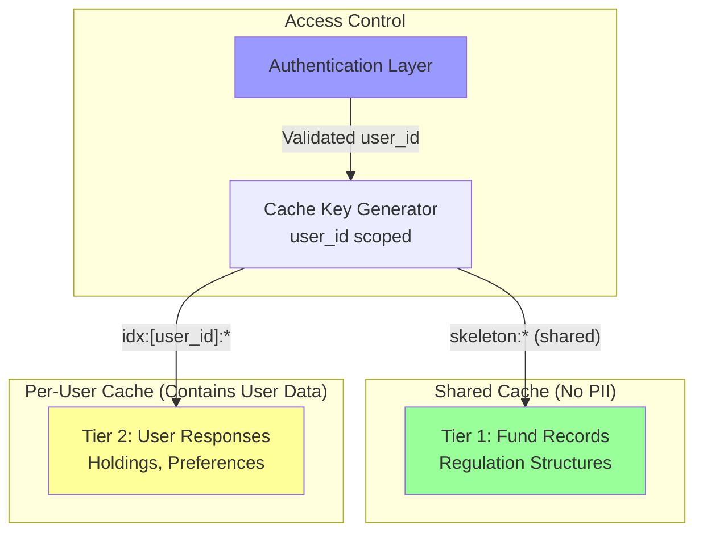
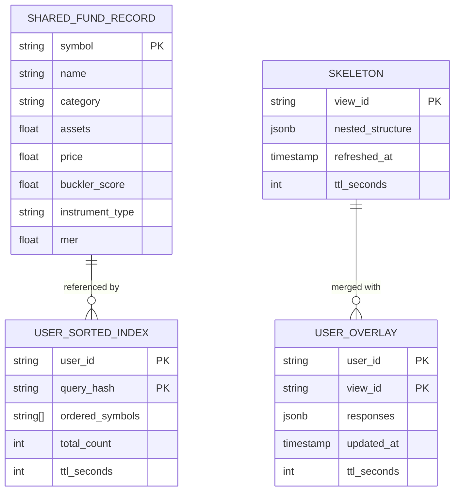
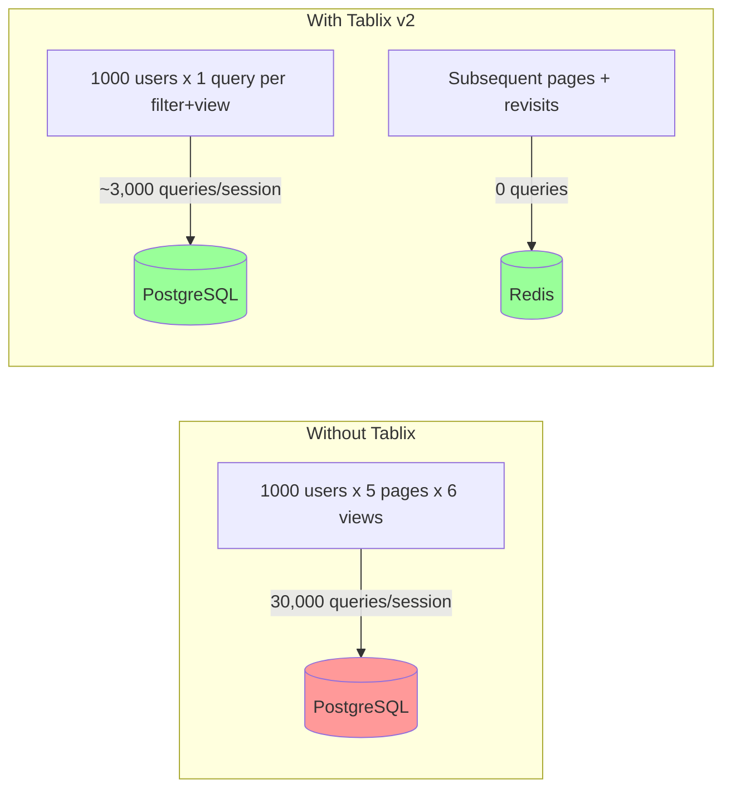
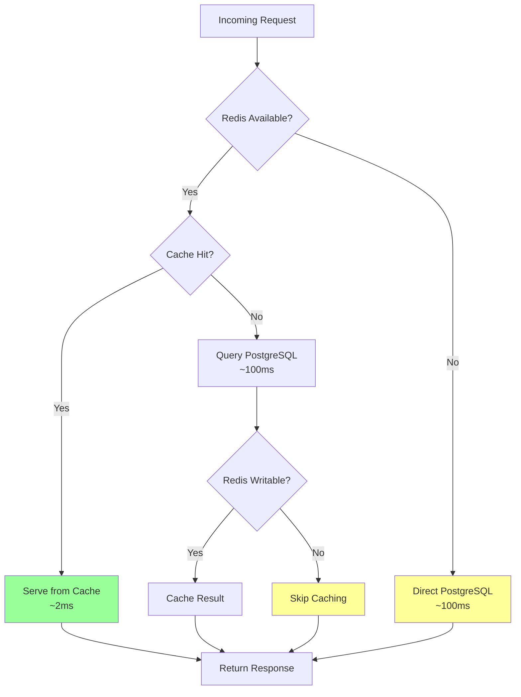
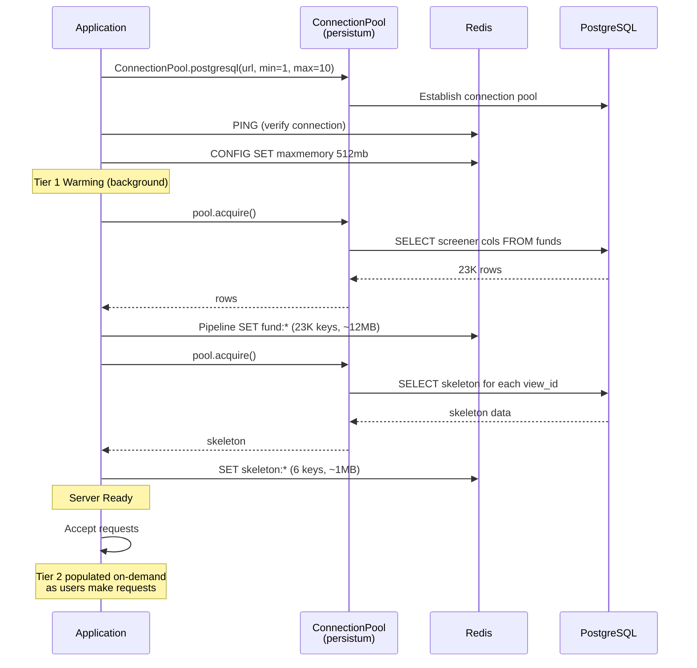

# Tablix Cache Architecture
## Version 2.0
### February 2026

---

## Executive Summary

### Problem Statement and Business Context

Multi-tenant SaaS applications serving personalized data from PostgreSQL face a fundamental scaling conflict: complex queries (6+ table joins, nested hierarchical output) take 50-200ms per request, but the results are unique per user — making traditional shared caching ineffective. Naive per-user result caching solves latency but explodes memory: 10,000 users x 6 views x 100KB = 6GB of Redis, with most of it being duplicated shared data.

The  Buckler platform exemplifies this challenge across two distinct patterns:
1. **IDD Advisor Fund Screener**: 23K shared fund records, but each user's filter/sort/page combination produces a unique result set
2. **CPM Compliance Views**: 6-table joins producing nested documents where half the data (regulations, requirements) is shared and half (user responses) is personal and frequently updated

Both patterns share the same structural problem: **the expensive part of the query is shared, but the result is personalized.**

### Proposed Solution Overview

Tablix v2 decomposes cached data along the **shared/personal boundary** using a two-tier architecture:

1. **Tier 1 — Shared Data Cache**: Expensive-to-compute reference data stored once, shared across all users. Refreshed on data change (daily ETL or regulatory update), not per-request.
2. **Tier 2 — Per-User Index/Overlay**: Lightweight, user-specific data (sorted symbol lists, response records) cached with short TTL. Invalidated on write.
3. **Merge at serve time**: Combine Tier 1 + Tier 2 in application code. Pure computation, no database round-trip.

This architecture reduces memory by ~10x while maintaining sub-millisecond response times for repeat requests.

### Key Architectural Decisions

1. **Separate Index from Data**: Per-user caches store only references (symbol IDs, requirement IDs) or lightweight overlays — never duplicated copies of shared record data. This is the primary memory optimization.

2. **Two Invalidation Clocks**: Shared data refreshes on a slow clock (hours/days). Personal data invalidates on write (seconds). Decoupling these eliminates unnecessary cache rebuilds.

3. **PostgreSQL on Miss, Redis on Hit**: Cold requests pay the full Postgres query cost once per session. All subsequent navigation (pagination, re-sort, tab switching) is pure Redis. The expensive query runs once, not per-interaction.

4. **Merge in Application Code**: The two tiers are combined in Python/application code rather than in the database or cache layer. This keeps both cache tiers simple and independently testable.

### Expected Outcomes and Benefits

**Performance Benefits:**
- Cache hit latency: <2ms (two Redis round-trips: index + MGET)
- Cache miss latency: 50-200ms (Postgres query, then cached for session)
- Pagination after first load: <2ms regardless of page number
- Zero degradation under concurrent load (Redis scales horizontally)

**Memory Benefits:**
- 10x reduction vs. full result caching (shared data stored once)
- 1,000 concurrent users: ~70MB Redis (vs. ~600MB naive caching)
- 10,000 concurrent users: ~600MB Redis (vs. 6GB+ naive caching)
- LRU eviction handles memory pressure gracefully

**Operational Benefits:**
- Postgres load reduced by 90%+ (only first request per session hits DB)
- Predictable memory growth (linear in active users, not in query combinations)
- Simple invalidation (user write → delete one key; data refresh → delete one key)

---

## 1. System Context

### 1.1 Current State Architecture

Prior to Tablix v2, two caching approaches were considered, both with significant drawbacks:



**Problems with Pattern A (No Cache):**
- Every page load runs a 6-table join against PostgreSQL
- 50-200ms per request, regardless of whether data changed
- PostgreSQL becomes bottleneck at 100+ concurrent users
- Pagination multiplies load (each page is a separate query)

**Problems with Pattern B (Full Result Cache):**
- Shared data (regulations, fund records) duplicated across every user's cache
- Memory grows as users x views x result_size — unsustainable past 1,000 users
- Invalidation is coarse: any write invalidates the entire cached result
- Cache warm-up is slow (must re-run the full join)

### 1.2 Integration Points and Dependencies



**External Dependencies:**
- PostgreSQL 15+ (source of truth)
- Redis 7+ (cache layer, LRU eviction)
- declaro-persistum (connection pool + query builder)
- Application runtime (Python 3.11+ with orjson for serialization)

**Database Access via declaro-persistum:**
Tablix uses declaro-persistum's `ConnectionPool` for database connections and its fluent query API for all SQL operations. No ORM, no SQLAlchemy — just pure functions operating on typed query objects with automatic dialect adaptation across PostgreSQL, SQLite, Turso, and LibSQL backends.

### 1.3 Data Flow Patterns

#### Pattern 1: Fund Screener



#### Pattern 2: Compliance View (Nested Documents)



### 1.4 Security Boundaries



**Security Boundary Principles:**

1. Tier 1 keys contain no user-identifying information — safe to share
2. Tier 2 keys are always scoped by authenticated user_id
3. Cache key generation is centralized — no ad-hoc key construction in endpoints
4. Redis ACLs can restrict Tier 2 access patterns if required
5. TTL ensures stale personal data is automatically purged

---

## 2. Technical Design

### 2.1 Component Architecture

```mermaid
graph TB
    subgraph "Application Components"
        Router[API Router<br/>Endpoint Handlers]
        QBuilder[declaro-persistum<br/>ConnectionPool + Query API]
        KeyGen[Key Generator<br/>Deterministic Cache Keys]
        Merger[Merge Engine<br/>Skeleton + Overlay]
        Serializer[Serializer<br/>orjson encode/decode]
    end

    subgraph "Cache Components"
        SharedCache[Shared Data Manager<br/>Tier 1 Lifecycle]
        UserCache[User Data Manager<br/>Tier 2 Lifecycle]
        Warmer[Cache Warmer<br/>Startup + Scheduled]
        Invalidator[Invalidation Handler<br/>Write-Through]
    end

    subgraph "Storage"
        Redis[(Redis)]
        Postgres[(PostgreSQL)]
    end

    Router --> KeyGen
    Router --> Merger
    KeyGen --> SharedCache
    KeyGen --> UserCache
    SharedCache --> Redis
    UserCache --> Redis
    SharedCache -.->|Miss| QBuilder
    UserCache -.->|Miss| QBuilder
    QBuilder -->|pool.acquire()| Postgres
    Warmer --> SharedCache
    Invalidator --> UserCache

    style SharedCache fill:#9f9
    style UserCache fill:#9f9
    style Warmer fill:#99f
    style Invalidator fill:#ff9
```

**Component Responsibilities:**

**Key Generator:**
- Produces deterministic cache keys from request parameters
- Screener: `idx:{user_id}:{md5(filters + sort)}` → per-user sorted index
- Skeleton: `skeleton:{view_id}` → shared nested structure
- Overlay: `overlay:{user_id}:{view_id}` → user-specific responses
- Fund data: `fund:{symbol}` → shared record data

**Shared Data Manager (Tier 1):**
- Loads fund screener columns and regulation skeletons into Redis
- Refreshes on schedule (daily ETL) or on-demand (regulatory change)
- Single writer, multiple readers
- Long TTL (hours to days)

**User Data Manager (Tier 2):**
- Manages per-user sorted indexes and response overlays
- Creates on first cache miss per session
- Invalidates on user write operations
- Short TTL (5-15 minutes)

**Merge Engine:**
- Combines Tier 1 skeleton with Tier 2 overlay in application code
- For screener: slices index → MGET fund records → assemble page
- For views: walks skeleton tree → attaches user responses at leaf nodes
- Pure function, no side effects, no database access

**Invalidation Handler:**
- Listens for write operations (user updates a response, submits a form)
- Deletes the affected Tier 2 key(s)
- Does NOT touch Tier 1 (shared data unaffected by user writes)

**Cache Warmer:**
- Loads Tier 1 shared data at application startup
- Optionally pre-warms Tier 2 for recently active users
- Runs as background task, does not block server startup

### 2.2 Communication Patterns

**Synchronous (request path):**
- Redis GET/MGET for cache reads (sub-millisecond)
- Merge engine computation (sub-millisecond)

**Synchronous on miss only:**
- PostgreSQL queries (50-200ms, but only on first request per session)

**Asynchronous (background):**
- Cache warming at startup
- Scheduled Tier 1 refresh (daily)
- Write-through invalidation (can be fire-and-forget)

**Event-Driven (optional):**
- PostgreSQL LISTEN/NOTIFY for Tier 1 invalidation on regulatory changes
- Application write hooks for Tier 2 invalidation

### 2.3 Data Ownership Model



**Data Isolation:**
- Tier 1 data is read-only from the application's perspective
- Tier 2 data is strictly scoped to the owning user_id
- No cross-user data access is possible through cache key structure
- TTL provides automatic cleanup of orphaned user data

---

## 3. Two-Tier Cache Architecture

### 3.1 Tier 1 — Shared Data Cache

Tier 1 stores data that is identical across all users. This is the expensive-to-compute, slow-to-change layer.

**Fund Screener: Per-Symbol Record Cache**

```python
# Loaded at startup, refreshed daily
# One Redis key per fund, shared by all users

from declaro_persistum import ConnectionPool
from declaro_persistum.query.table import table

funds = table("funds")

async def warm_fund_cache(redis: Redis, pool: ConnectionPool) -> None:
    """Load all fund screener columns into Redis."""
    async with pool.acquire() as conn:
        rows = await (
            funds
            .select(
                funds.symbol, funds.name, funds.category,
                funds.assets, funds.price, funds.buckler_score,
                funds.instrument_type, funds.mer,
            )
            .execute(conn)
        )

    pipe = redis.pipeline()
    for row in rows:
        pipe.set(
            f"fund:{row['symbol']}",
            orjson.dumps(row),
            ex=86400,  # 24 hour TTL
        )
    await pipe.execute()
    # ~23K keys, ~12MB total
```

**Compliance View: Skeleton Cache**

```python
# Pre-joined regulation structure, no user-specific data
# Cached per view_id, refreshed on regulatory change

from declaro_persistum import ConnectionPool
from declaro_persistum.query import execute

async def warm_skeleton(redis: Redis, pool: ConnectionPool, view_id: str) -> dict:
    """Build and cache the shared regulation skeleton."""
    # This is the expensive 6-table join — runs once
    # Complex aggregation queries use persistum's execute() with raw SQL
    async with pool.acquire() as conn:
        skeleton = await execute(
            {
                "sql": """
                    SELECT rc.id, rc.name,
                           json_agg(json_build_object(
                               'id', r.id,
                               'title', r.title,
                               'requirements', (
                                   SELECT json_agg(json_build_object(
                                       'id', req.id,
                                       'text', req.text,
                                       'sub_requirements', (...)
                                   ))
                                   FROM requirements req WHERE req.regulation_id = r.id
                               )
                           )) as regulations
                    FROM regulation_categories rc
                    JOIN regulations r ON r.category_id = rc.id
                    WHERE rc.view_id = :view_id
                    GROUP BY rc.id
                """,
                "params": {"view_id": view_id},
            },
            conn,
        )

    tree = build_nested_structure(skeleton)

    await redis.set(
        f"skeleton:{view_id}",
        orjson.dumps(tree),
        ex=86400,  # 24 hours
    )
    return tree
```

**Tier 1 Characteristics:**
- Loaded at startup or on first miss
- Refreshed on slow clock (daily ETL, regulatory change)
- Shared by all users — one copy in Redis
- Memory: fixed, predictable (~12MB for funds, ~50-200KB per skeleton)

### 3.2 Tier 2 — Per-User Cache

Tier 2 stores lightweight, user-specific data. This is the cheap-to-compute, fast-to-change layer.

**Fund Screener: Sorted Symbol Index**

```python
from declaro_persistum import ConnectionPool
from declaro_persistum.query.table import table

funds = table("funds")

async def get_or_create_index(
    redis: Redis,
    pool: ConnectionPool,
    user_id: str,
    query: ScreenerQuery,
) -> list[str]:
    """Get cached sorted index, or build from Postgres on miss."""
    key = f"idx:{user_id}:{query.cache_hash()}"

    # Try cache first
    cached = await redis.get(key)
    if cached:
        return orjson.loads(cached)

    # Cache miss — query Postgres for sorted symbol list only
    # This is much cheaper than SELECT * — just one column, indexed
    async with pool.acquire() as conn:
        result = await (
            funds
            .select(funds.symbol)
            .where(build_filters(query))
            .order_by(build_sort(query))
            .execute(conn)
        )
    symbols = [row["symbol"] for row in result]

    # Cache the index (just an ordered list of strings)
    await redis.set(key, orjson.dumps(symbols), ex=300)  # 5 min TTL
    return symbols
```

**Compliance View: User Response Overlay**

```python
from declaro_persistum import ConnectionPool
from declaro_persistum.query.table import table

responses = table("user_responses")

async def get_or_create_overlay(
    redis: Redis,
    pool: ConnectionPool,
    user_id: str,
    view_id: str,
) -> dict[int, dict]:
    """Get cached user responses, or fetch from Postgres on miss."""
    key = f"overlay:{user_id}:{view_id}"

    cached = await redis.get(key)
    if cached:
        return orjson.loads(cached)

    # Cache miss — simple single-table query, indexed by user_id
    async with pool.acquire() as conn:
        result = await (
            responses
            .select()
            .where(
                (responses.user_id == user_id)
                & (responses.view_id == view_id)
            )
            .execute(conn)
        )
    overlay = {row["requirement_id"]: row for row in result}

    await redis.set(key, orjson.dumps(overlay), ex=900)  # 15 min TTL
    return overlay
```

**Tier 2 Characteristics:**
- Created on first cache miss per user session
- Short TTL (5-15 minutes), covers active browsing session
- Invalidated immediately on user write
- Memory per entry: ~2-140KB (response overlays are small, symbol lists are larger but compress well)

### 3.3 Merge Engine

The merge engine combines Tier 1 and Tier 2 in application code. No database access, no Redis writes — pure computation.

**Screener Merge: Index Slice + Record Hydration**

```python
async def serve_screener_page(
    redis: Redis,
    user_id: str,
    query: ScreenerQuery,
    symbols: list[str],
) -> ScreenerResult:
    """Paginate a cached index and hydrate from shared fund cache."""
    total = len(symbols)
    offset = (query.page - 1) * query.limit
    page_symbols = symbols[offset : offset + query.limit]

    # Hydrate from Tier 1 (one MGET, 25 keys)
    keys = [f"fund:{s}" for s in page_symbols]
    raw_rows = await redis.mget(keys)
    rows = [orjson.loads(r) for r in raw_rows if r is not None]

    return ScreenerResult(rows=rows, total=total, page=query.page, limit=query.limit)
```

**View Merge: Skeleton + Overlay Tree Walk**

```python
def merge_view(skeleton: dict, overlay: dict[int, dict]) -> dict:
    """Attach user responses to the shared regulation skeleton.

    Walks the nested tree structure, attaching overlay data at
    requirement leaf nodes. Returns a new tree (does not mutate skeleton).
    """
    import copy
    tree = copy.deepcopy(skeleton)

    for category in tree.get("categories", []):
        for regulation in category.get("regulations", []):
            for requirement in regulation.get("requirements", []):
                req_id = requirement["id"]
                requirement["response"] = overlay.get(req_id)

                for sub_req in requirement.get("sub_requirements", []):
                    sub_req["response"] = overlay.get(sub_req["id"])

    return tree
```

**Merge Characteristics:**
- Pure function: same inputs always produce same output
- No side effects: no DB queries, no cache writes
- Sub-millisecond: Python dict operations on pre-parsed data
- Testable in isolation: no infrastructure dependencies

### 3.4 Invalidation Strategy

```mermaid
graph TB
    subgraph "Tier 1 Invalidation (Slow Clock)"
        ETL[Daily ETL / Data Refresh] -->|Delete| FundKeys[fund:* keys]
        RegChange[Regulatory Change] -->|Delete| SkelKey[skeleton:{view_id}]
        FundKeys -->|Next Request| Rewarm1[Re-warm from Postgres]
        SkelKey -->|Next Request| Rewarm2[Re-build skeleton]
    end

    subgraph "Tier 2 Invalidation (Fast Clock)"
        UserWrite[User Updates Response] -->|Delete| OverKey[overlay:{user_id}:{view_id}]
        FilterChange[User Changes Filters] -->|New Key| IdxKey[idx:{user_id}:{new_hash}]
        TTLExpiry[TTL Expiry 5-15min] -->|Automatic| Cleanup[Key Evicted]
    end

    style ETL fill:#99f
    style RegChange fill:#99f
    style UserWrite fill:#ff9
    style TTLExpiry fill:#9f9
```

**Invalidation Rules:**

| Event | Action | Keys Affected | Cost |
|-------|--------|---------------|------|
| Daily ETL (fund data refresh) | Delete all `fund:*`, re-warm | ~23K shared keys | ~2s (background) |
| Regulatory change | Delete `skeleton:{view_id}` | 1 shared key | Instant |
| User updates a response | Delete `overlay:{user_id}:{view_id}` | 1 per-user key | Instant |
| User changes screener filters | No invalidation needed — new hash creates new key | 0 keys | Free |
| User session expires | TTL auto-eviction | Per-user keys naturally expire | Free |
| Memory pressure | Redis LRU eviction | Least recently used Tier 2 keys | Automatic |

**Critical Design Principle:** User writes never invalidate Tier 1. Shared data refreshes never invalidate Tier 2. The two tiers are **independently invalidated** on separate clocks.

---

## 4. Memory Model

### 4.1 Memory Budget Analysis

**Tier 1 — Shared (Fixed Cost):**

| Data | Keys | Size Per Key | Total |
|------|------|-------------|-------|
| Fund screener records | 23,000 | ~500 bytes | ~12 MB |
| Compliance skeleton (per view) | 6 | ~50-200 KB | ~1 MB |
| **Tier 1 Total** | | | **~13 MB** |

**Tier 2 — Per-User (Variable Cost):**

| Data | Size Per Entry | Entries Per User | Per User Total |
|------|---------------|-----------------|----------------|
| Sorted symbol index | ~140 KB | 1-3 active filters | ~200-420 KB |
| Response overlay | ~5-20 KB | 1-6 views | ~10-120 KB |
| **Tier 2 Per User** | | | **~210-540 KB** |

**Scaling Projections:**

| Concurrent Users | Tier 1 (Fixed) | Tier 2 (Variable) | Total | vs. Naive Cache |
|-----------------|----------------|-------------------|-------|-----------------|
| 100 | 13 MB | 21-54 MB | ~70 MB | ~60 MB saved |
| 1,000 | 13 MB | 210-540 MB | ~550 MB | ~550 MB saved |
| 10,000 | 13 MB | 2.1-5.4 GB | ~5 GB | ~5.5 GB saved |

**With LZ4 Compression on Tier 2 Indexes (~5x ratio):**

| Concurrent Users | Tier 1 | Tier 2 (Compressed) | Total |
|-----------------|--------|---------------------|-------|
| 1,000 | 13 MB | 42-108 MB | ~120 MB |
| 10,000 | 13 MB | 420 MB - 1.1 GB | ~1 GB |

### 4.2 Memory Management

```python
# Redis maxmemory configuration
# Tier 2 keys are evicted first (shorter TTL + LRU)
REDIS_CONFIG = {
    "maxmemory": "512mb",
    "maxmemory-policy": "allkeys-lru",
}
```

**Eviction Priority:** Redis LRU naturally evicts Tier 2 keys first because they have shorter TTLs and are accessed less frequently than Tier 1 keys. Under memory pressure, idle user sessions are evicted before shared data — which is the desired behavior.

**Optional: Separate Redis Databases**

For stricter memory control, Tier 1 and Tier 2 can be placed in separate Redis databases or instances:

```python
tier1_redis = Redis(db=0)  # Shared data, protected from eviction
tier2_redis = Redis(db=1)  # Per-user data, LRU eviction enabled
```

---

## 5. Performance Characteristics

### 5.1 Latency Profile

| Operation | Latency | When |
|-----------|---------|------|
| Screener page (cache hit) | ~2 ms | User paginates, re-sorts |
| Screener page (index miss) | ~80-100 ms | First filter combo per session |
| Compliance view (both hit) | ~3 ms | User revisits within TTL |
| Compliance view (overlay miss) | ~15 ms | First view load per session |
| Compliance view (both miss) | ~150-200 ms | First request after regulatory change |
| User writes a response | ~10 ms | Write to Postgres + invalidate 1 Redis key |

### 5.2 Benchmark Results (from IDD Speed Tests)

The following results compare three architectures at 7 concurrency levels on the fund screener workload (23K records, realistic traffic mix):

| Users | SQLite Req/s | SQLite Med | Redis Req/s | Redis Med | Tablix v1 Req/s | Tablix v1 Med |
|------:|-----------:|-----------:|-----------:|----------:|----------------:|--------------:|
| 1 | 1 | 11 ms | 1 | 7 ms | 1 | 12 ms |
| 10 | 8 | 9 ms | 8 | 7 ms | 8 | 9 ms |
| 50 | 40 | 11 ms | 40 | 4 ms | 40 | 6 ms |
| 100 | 75 | 36 ms | 80 | 4 ms | 78 | 9 ms |
| 250 | 104 | 860 ms | 193 | 9 ms | 170 | 89 ms |
| 500 | 106 | 1,300 ms | 286 | 77 ms | 192 | 990 ms |
| 1,000 | 147 | 1,400 ms | 294 | 80 ms | 186 | 3,000 ms |

**Tablix v1 Limitation:** These results reflect v1's per-query result caching approach with low cache hit rates due to diverse query combinations. Tablix v2's index-based caching is expected to achieve hit rates closer to the pure Redis architecture while maintaining the memory efficiency shown above.

**Why v2 Will Perform Better:**
- v1 cached page results (page 1 and page 2 are different cache entries)
- v2 caches the full sorted index once — any page is a slice
- A user browsing 10 pages causes 1 Postgres query in v2 vs. 10 in v1

### 5.3 PostgreSQL Load Reduction



**~90% reduction in PostgreSQL queries** for typical browsing sessions.

---

## 6. Code Organization

### 6.1 File Structure

```
tablix/
├── cache/
│   ├── keys.py              # Key generation (deterministic, scoped)
│   ├── tier1.py             # Shared data manager (fund records, skeletons)
│   ├── tier2.py             # Per-user data manager (indexes, overlays)
│   ├── warmer.py            # Startup + scheduled warming
│   └── invalidation.py      # Write-through invalidation hooks
├── merge/
│   ├── screener.py          # Index slice + record hydration
│   └── views.py             # Skeleton + overlay tree walk
├── models.py                # ScreenerQuery, ScreenerResult, ViewResult
├── config.py                # TTLs, Redis URLs, feature flags
└── tests/
    ├── test_keys.py         # Key generation determinism
    ├── test_tier1.py        # Shared cache lifecycle
    ├── test_tier2.py        # Per-user cache lifecycle
    ├── test_merge.py        # Merge engine correctness
    ├── test_invalidation.py # Write-through invalidation
    └── test_memory.py       # Memory budget compliance
```

### 6.2 Key Generation Contract

```python
class CacheKeys:
    """Centralized, deterministic cache key generation.

    All cache keys flow through this class. No ad-hoc key
    construction in endpoint handlers.
    """

    @staticmethod
    def fund(symbol: str) -> str:
        return f"fund:{symbol}"

    @staticmethod
    def skeleton(view_id: str) -> str:
        return f"skeleton:{view_id}"

    @staticmethod
    def user_index(user_id: str, query: ScreenerQuery) -> str:
        return f"idx:{user_id}:{query.cache_hash()}"

    @staticmethod
    def user_overlay(user_id: str, view_id: str) -> str:
        return f"overlay:{user_id}:{view_id}"
```

---

## 7. Security Architecture

### 7.1 Threat Model

| Threat | Risk | Mitigation |
|--------|------|------------|
| Cross-user data leakage | User A sees User B's responses | All Tier 2 keys scoped by authenticated user_id; key generation is centralized |
| Cache poisoning | Attacker writes bad data to shared cache | Application is sole writer to Redis; no direct client access |
| Stale data after write | User updates response but sees old data | Write-through invalidation deletes Tier 2 key synchronously before response |
| Enumeration via cache keys | Attacker probes for valid user_ids | Redis not exposed externally; key format is opaque (hashed query params) |
| Memory exhaustion (DoS) | Attacker creates many unique filter combos | Redis maxmemory + LRU eviction; rate limiting at API layer |

### 7.2 Access Control

```python
# Every cache read/write is scoped to the authenticated user
async def get_user_overlay(
    request: Request, view_id: str, redis: Redis, pool: ConnectionPool,
) -> dict:
    user_id = request.state.user_id  # From auth middleware
    key = CacheKeys.user_overlay(user_id, view_id)  # Scoped key

    cached = await redis.get(key)
    if cached:
        return orjson.loads(cached)

    # Cache miss — fetch via persistum
    return await get_or_create_overlay(redis, pool, user_id, view_id)

# Tier 1 reads require no user scoping (shared data)
async def get_skeleton(view_id: str, redis: Redis) -> dict:
    return await redis.get(CacheKeys.skeleton(view_id))
```

**Principle:** Tier 2 operations always receive user_id from the authentication layer, never from client input.

---

## 8. Error Handling

### 8.1 Degradation Strategy

Tablix is designed as a **performance optimization, not a functional dependency**. If the cache layer fails, the application falls back to direct PostgreSQL queries — slower, but fully functional.



**Degradation Levels:**

1. **Full Performance** — Both tiers cached, merge in memory (~2ms)
2. **Partial Cache** — Tier 1 hit, Tier 2 miss — single-table Postgres query (~15ms)
3. **No Cache** — Redis unavailable — full Postgres queries (~100-200ms)
4. **Read-Only Mode** — Postgres available for reads, writes queued

### 8.2 Error Classification

| Error | Recovery | User Impact |
|-------|----------|-------------|
| Redis connection timeout | Fall back to Postgres | +100ms latency, no data loss |
| Redis OOM (maxmemory) | LRU evicts cold keys | Slightly more cache misses |
| Tier 1 key missing | Re-warm from Postgres (background) | One slow request, then cached |
| Tier 2 key missing | Re-fetch user data from Postgres | One slow request per session |
| Merge error (bad skeleton) | Log + return Postgres result directly | Slightly different JSON shape |
| Postgres unavailable | Serve from cache (stale but available) | Read-only mode, data may be stale |

---

## 9. Testing Strategy

### 9.1 Test Coverage Requirements

- **Unit Tests:** >95% coverage on merge engine and key generation
- **Integration Tests:** Cache hit/miss paths, invalidation flows
- **Load Tests:** Memory budget compliance under concurrent users
- **Chaos Tests:** Redis failure, Postgres failure, mixed failures

### 9.2 Key Test Scenarios

```gherkin
Feature: Two-Tier Cache Correctness
  As an API server
  I want to serve consistent data from cache
  So that users see correct, up-to-date information

  Scenario: Screener pagination from cached index
    Given a user has loaded page 1 of the fund screener
    And their sorted index is cached in Redis
    When they request page 2
    Then the response should come from Redis only (no Postgres query)
    And response time should be under 5ms
    And the sort order should be consistent with page 1

  Scenario: User updates a response
    Given a user has a cached compliance view
    When they update a response to a requirement
    Then the overlay cache should be invalidated
    And the skeleton cache should NOT be invalidated
    And the next view request should show the updated response

  Scenario: Regulatory change invalidation
    Given 1000 users have cached compliance views
    When a regulation is updated in PostgreSQL
    Then only the skeleton cache key should be invalidated
    And user overlay caches should remain valid
    And the first request from any user should rebuild the skeleton
    And subsequent requests should use the new cached skeleton

  Scenario: Redis failure graceful degradation
    Given the application is serving requests normally
    When Redis becomes unavailable
    Then requests should fall back to PostgreSQL
    And response times should increase but not error
    And when Redis recovers, caching should resume automatically
```

### 9.3 Memory Budget Test

```python
def test_memory_budget_1000_users():
    """Verify memory stays within budget at 1000 concurrent users."""
    redis_info = redis.info("memory")
    used_mb = redis_info["used_memory"] / (1024 * 1024)

    # Simulate 1000 users with 3 filter combos + 6 view overlays each
    for user_id in range(1000):
        for query_hash in ["abc", "def", "ghi"]:
            redis.set(f"idx:{user_id}:{query_hash}", sample_index, ex=300)
        for view_id in range(6):
            redis.set(f"overlay:{user_id}:{view_id}", sample_overlay, ex=900)

    used_after = redis.info("memory")["used_memory"] / (1024 * 1024)
    delta_mb = used_after - used_mb

    assert delta_mb < 512, f"Memory budget exceeded: {delta_mb:.0f}MB used"
```

---

## 10. Deployment Architecture

### 10.1 Configuration

```python
# tablix/config.py
from dataclasses import dataclass

@dataclass(frozen=True)
class TablixConfig:
    # Database (via declaro-persistum ConnectionPool)
    database_url: str = "postgresql://localhost:5432/app"
    pool_min_size: int = 1
    pool_max_size: int = 10

    # Redis
    redis_url: str = "redis://localhost:6379"
    redis_max_memory: str = "512mb"

    # Tier 1 TTLs
    fund_record_ttl: int = 86400       # 24 hours
    skeleton_ttl: int = 86400          # 24 hours

    # Tier 2 TTLs
    user_index_ttl: int = 300          # 5 minutes
    user_overlay_ttl: int = 900        # 15 minutes

    # Compression
    compress_indexes: bool = True       # LZ4 compress sorted indexes
    compression_threshold: int = 1024   # Only compress if > 1KB

    # Warming
    warm_tier1_on_startup: bool = True
    warm_tier2_for_recent_users: bool = False
```

**Connection Pool Initialization:**

```python
from declaro_persistum import ConnectionPool

async def create_pool(config: TablixConfig) -> ConnectionPool:
    """Create a persistum connection pool from Tablix config."""
    return await ConnectionPool.postgresql(
        config.database_url,
        min_size=config.pool_min_size,
        max_size=config.pool_max_size,
    )
```

### 10.2 Startup Sequence



### 10.3 Monitoring

**Key Metrics:**

| Metric | Target | Alert Threshold |
|--------|--------|-----------------|
| Tier 1 hit rate | >99% | <95% |
| Tier 2 hit rate | >80% | <60% |
| Redis memory usage | <80% of maxmemory | >90% |
| Cache miss latency (p95) | <200ms | >500ms |
| Merge time (p95) | <2ms | >10ms |
| Postgres queries/sec | <100 | >500 (cache not working) |

---

## 11. Risk Assessment

### 11.1 Technical Risks

| Risk | Likelihood | Impact | Mitigation |
|------|-----------|--------|------------|
| Redis OOM under load | Medium | Medium | LRU eviction, memory budget tests, alerts at 80% |
| Stale skeleton after regulatory change | Low | High | LISTEN/NOTIFY or webhook-triggered invalidation |
| Index/record inconsistency (fund deleted but index references it) | Low | Low | MGET returns nil for missing keys — filter in merge |
| Hot key (popular skeleton accessed by all users) | Medium | Low | Redis handles high read concurrency well; replicas if needed |
| Merge engine bug produces incorrect output | Low | High | Comprehensive unit tests, integration tests with real data |

### 11.2 Operational Risks

| Risk | Likelihood | Impact | Mitigation |
|------|-----------|--------|------------|
| Redis instance failure | Low | Medium | Automatic fallback to Postgres; Redis Sentinel for HA |
| Tier 1 warm-up blocks startup | Low | Medium | Background warming; server accepts requests immediately |
| TTL misconfiguration | Medium | Medium | Config validation on startup; reasonable defaults |
| Memory leak in per-user keys | Low | Medium | TTL guarantees cleanup; monitoring alerts |

### 11.3 Business Continuity

**Scenario: Redis Complete Failure**
1. Application detects connection error (circuit breaker)
2. All requests fall back to PostgreSQL (~100-200ms)
3. No data loss (Redis is cache, not source of truth)
4. When Redis recovers, Tier 1 re-warms automatically
5. Tier 2 populates organically as users make requests

**Scenario: PostgreSQL Failure**
1. All cache hits continue to serve (~2ms)
2. Cache misses return error or stale data (configurable)
3. Writes are rejected or queued
4. When Postgres recovers, normal operation resumes
5. No cache invalidation needed (cache data is still valid)

---

## 12. Decision Log

### Decision 1: Two-Tier Cache vs. Single Full-Result Cache

**Date:** 2026-02-15
**Decision:** Decompose cache into shared data (Tier 1) and per-user data (Tier 2)
**Alternatives Considered:**
- Cache full query results per user (Tablix v1)
- Cache nothing, optimize Postgres queries
- Materialize views in Postgres

**Rationale:**
- Benchmark showed v1's per-query caching has low hit rate with diverse filters
- Full result caching duplicates shared data across all users (10x memory waste)
- Two-tier separation mirrors the actual data ownership boundary
- Memory scales with active users, not with query combinations

**Trade-offs Accepted:**
- Two Redis round-trips per request instead of one
- Merge logic adds application complexity
- Slightly higher latency on cache hit (~2ms vs ~1ms) due to MGET step

### Decision 2: Sorted Index vs. Cached Page Results

**Date:** 2026-02-15
**Decision:** Cache the full sorted symbol list, paginate by slicing
**Alternatives Considered:**
- Cache each page separately (v1 approach)
- Cache only first 3 pages, Postgres for rest

**Rationale:**
- One Postgres query covers all pages (user browses 10 pages → 1 query, not 10)
- Consistent sort order across pages guaranteed (no edge cases at page boundaries)
- Index size (~140KB) is smaller than caching all pages of row data
- Total count comes free from len(index)

**Trade-offs Accepted:**
- 140KB per user per filter combo (larger than a single page result)
- Must deserialize full index even for page 1 (mitigated by compression)

### Decision 3: Skeleton + Overlay vs. Entity-Level Cache

**Date:** 2026-02-15
**Decision:** Cache complete skeleton as one blob, overlay as one blob per user per view
**Alternatives Considered:**
- Cache each regulation/requirement as individual Redis keys
- Cache at the category level (medium granularity)

**Rationale:**
- One GET per tier is simpler and faster than many MGETs
- Skeletons are small enough (<200KB) for single-key storage
- Invalidation is simpler (delete one key vs. traversing the tree to find affected keys)
- Entity-level cache adds complexity without proportional benefit at this scale

**Trade-offs Accepted:**
- Regulatory change invalidates entire skeleton (not just changed regulation)
- But regulatory changes are rare (monthly), so this is acceptable
- If skeleton grows beyond 1MB, reconsider entity-level caching

### Decision 4: Redis as Cache Layer, Not Source of Truth

**Date:** 2026-02-15
**Decision:** PostgreSQL remains source of truth; Redis is a disposable cache
**Alternatives Considered:**
- Redis as primary store with Postgres backup
- Dual-write to both stores

**Rationale:**
- Simplifies consistency model (one source of truth)
- Redis failure is a performance degradation, not a data loss event
- No distributed transaction complexity
- Existing Postgres backup/recovery infrastructure applies unchanged

**Trade-offs Accepted:**
- Cold start requires Postgres queries (mitigated by Tier 1 warming)
- Cannot serve reads during Postgres outage for cache misses

---

## 13. Appendices

### 13.1 Glossary

**Tier 1 (Shared Data Cache):** Redis cache layer containing data identical across all users — fund records, regulation skeletons. Long TTL, refreshed on data change events.

**Tier 2 (Per-User Cache):** Redis cache layer containing user-specific data — sorted indexes, response overlays. Short TTL, invalidated on user writes.

**Skeleton:** Pre-computed nested document structure representing the shared/static portion of a complex view (regulations, requirements hierarchy). Stored as a single JSON blob in Tier 1.

**Overlay:** Flat key-value map of a user's responses to requirements within a view. Stored as a single JSON blob per user per view in Tier 2.

**Sorted Index:** Ordered list of fund symbols matching a user's filter and sort criteria. Stored in Tier 2. Any page can be served by slicing this list.

**Merge:** The process of combining a Tier 1 skeleton with a Tier 2 overlay in application code to produce the final response. Pure computation, no I/O.

**Cache Hash:** Deterministic hash of query parameters (filters, sort column, sort direction) used to generate unique Tier 2 cache keys per filter combination.

**LRU Eviction:** Redis memory management policy that evicts least recently used keys when maxmemory is reached. Naturally prioritizes eviction of idle user sessions over active shared data.

### 13.2 Cache Key Reference

| Pattern | Example | Tier | TTL | Size |
|---------|---------|------|-----|------|
| `fund:{symbol}` | `fund:VOO` | 1 | 24h | ~500 bytes |
| `skeleton:{view_id}` | `skeleton:compliance` | 1 | 24h | ~50-200 KB |
| `idx:{user_id}:{hash}` | `idx:42:a8f3dc01` | 2 | 5 min | ~140 KB |
| `overlay:{user_id}:{view_id}` | `overlay:42:compliance` | 2 | 15 min | ~5-20 KB |

### 13.3 Memory Calculation Worksheet

```
Tier 1 (Fixed):
  23,000 fund records × 500 bytes    =  11.5 MB
  6 skeletons × 150 KB average       =   0.9 MB
  Tier 1 Total                        =  12.4 MB

Tier 2 Per User:
  3 screener indexes × 140 KB        = 420 KB
  6 view overlays × 15 KB            =  90 KB
  Per User Total                      = 510 KB

With LZ4 compression on indexes (~5x):
  3 screener indexes × 28 KB         =  84 KB
  6 view overlays × 15 KB            =  90 KB
  Per User Compressed                 = 174 KB

At 1,000 users (compressed):
  Tier 1:  12 MB
  Tier 2:  174 KB × 1,000 = 174 MB
  Total:   186 MB

At 10,000 users (compressed):
  Tier 1:  12 MB
  Tier 2:  174 KB × 10,000 = 1.7 GB
  Total:   1.7 GB
  (With LRU eviction at 512MB, ~2,900 users fully cached at any time)
```

---

## Quality Checklist

- [x] All diagrams use Mermaid syntax
- [x] All diagrams have descriptive context
- [x] Component names in diagrams match code examples
- [x] Both use cases covered (screener + compliance views)
- [x] Memory budget analyzed at multiple user scales
- [x] Benchmark data included from actual load tests
- [x] Security boundaries clearly defined (Tier 1 shared, Tier 2 scoped)
- [x] Error scenarios covered with graceful degradation
- [x] Invalidation strategy documented for all write patterns
- [x] Testing approach specified (unit, integration, load, chaos)
- [x] Deployment configuration documented
- [x] Risks identified with concrete mitigations
- [x] Decisions justified with rationale and trade-offs
- [x] Glossary defines all Tablix-specific terminology

---

**Document Status:** Complete
**Version:** 2.0
**Owner:** Adam Wasserman
**Next Review Date:** 2026-05-15
